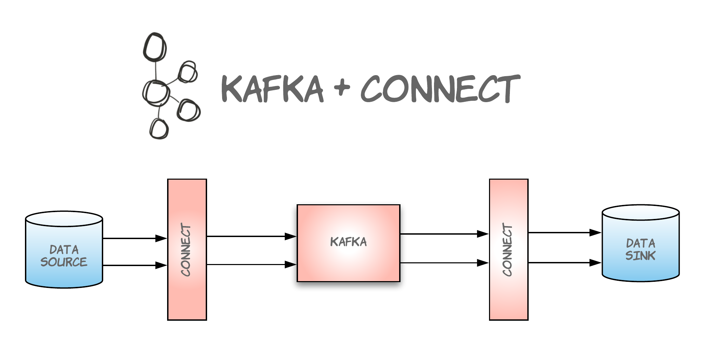
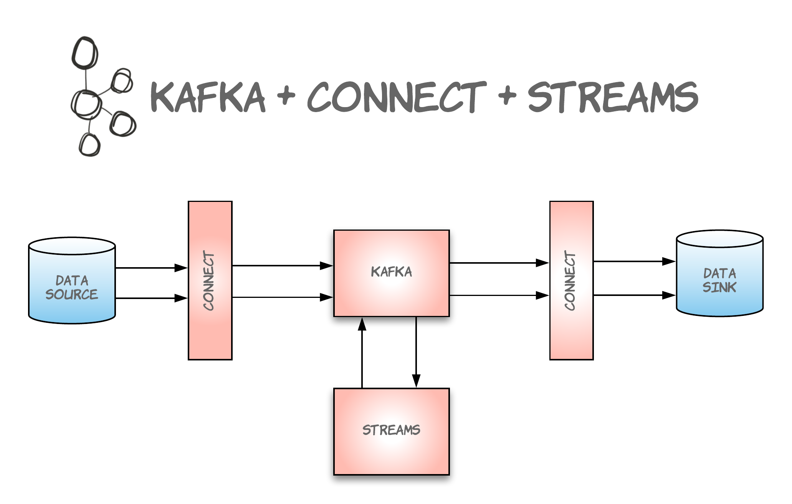
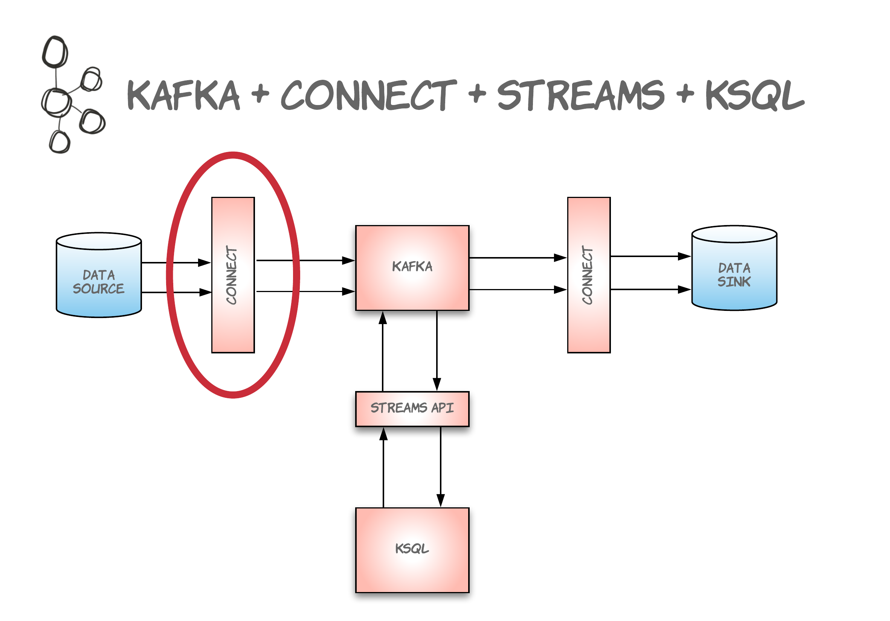

## [Kafka Ecosystem](https://cwiki.apache.org/confluence/display/KAFKA/Ecosystem)

---

<aside class="notes">
- traditional kafka cluster
- old school consumers/producers (can do everything the services in the next slides can do)
</aside>
---

---

---

---

