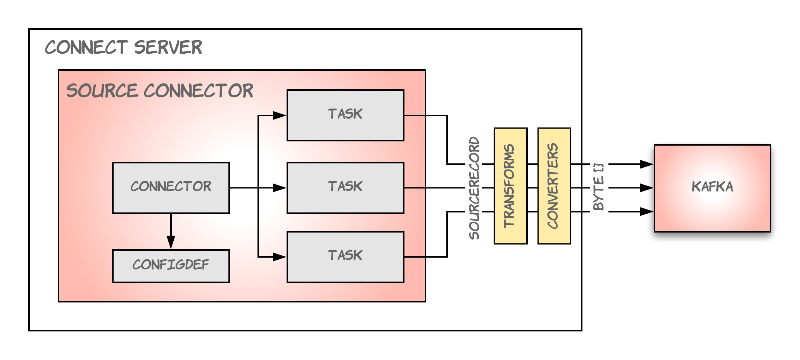
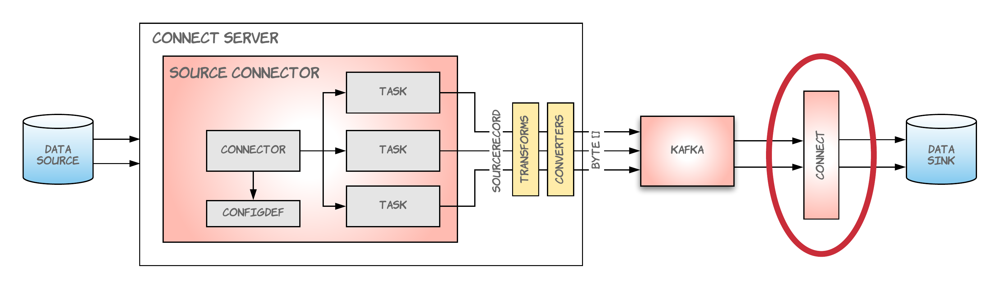

## Source Connector

---

### Open Source

* Variety of connectors on Github
  * JDBC, Elasticsearch, MongoDB, S3, etc
* Confluent Hub: https://www.confluent.io/hub/

<aside class="notes">
  community is growing FAST <br/>
  most major data technologies already have a connector <br/>
  a lot of room for improvement (JDBC)
</aside>

---

### Build Your Own

Every connector boils down to a few pieces

* ConfigDef
* Connector
* Task

---

### ConfigDef

```groovy
ConfigDef()
        .define(
            "spotify.username",
            ConfigDef.Type.STRING,
            "anonymous",
            ConfigDef.Importance.HIGH,
            "Spotify username."
        )
        .define(
            "spotify.access.token",
            ConfigDef.Type.PASSWORD,
            "",
            ConfigDef.Importance.MEDIUM,
            "Access token for Spotify API."
        )
```

<aside class="notes">
name, type, default, documentation, group info, order, width, display name
</aside>

---

### Connector

```groovy
public abstract class Connector {
    public abstract String version();
    public abstract void start(Map<String, String> props);
    public abstract Class<? extends Task> taskClass();
    public abstract List<Map<String, String>> taskConfigs(int maxTasks);
    public abstract void stop();
    public abstract ConfigDef config();
    public void reconfigure(Map<String, String> props) {}
    public Config validate(Map<String, String> connectorConfigs) {}
}
```

<aside class="notes">
- data copied must be a partitioned stream so that each task can be assigned a subset of partitions <br/>
- Connector Context available that can interact with Connect runtime <br/>
- validate - validates provided configs against ConfigDef <br/>
- reconfigure() - not usually overridden (calls stop(), start())
- reconfigure may be used by a dynamic connector (monitor database table added/removed)
</aside>

---

### Source Task

```groovy
public abstract class SourceTask implements Task {
    public abstract void start(Map<String, String> props);
    public abstract List<SourceRecord> poll();
    public abstract void stop();
    public void commit() {}
    public void commitRecord(SourceRecord record) {}
}
```

<aside class="notes">
`commit/commitRecord`- intentionally blank (Kafka Connect records offsets automatically)
This is provided for systems that ALSO store offsets internally<br/>
Each source task has a dedicated thread
</aside>

---

### SourceRecord

```groovy
SourceRecord(
  Map sourcePartition,
  Map sourceOffset,
  String topic,
  Schema keySchema,
  Object key,
  Schema valueSchema,
  Object value
)
```

<!--

---
# Schema

---

### SchemaBuilder + AvroConverter

```groovy
SchemaBuilder.struct()
      .name(LOGICAL_NAME)
      .version(VERSION)
      .field(PLAYED_AT_FIELD, Timestamp.SCHEMA)
      .field(TRACK_FIELD, Track.SCHEMA)
      .field(CONTEXT_FIELD, Context.SCHEMA)
      .build()
```

<aside class="notes">
AvroConverter takes a Struct (which includes the Schema) and handles serialization
</aside>

---

### Extension functions FTW!

```
fun PlayHistoryModel.toStruct(): Struct = Struct(PlayHistory.SCHEMA)
        .put(PlayHistory.PLAYED_AT_FIELD, this.playedAt)
        .put(PlayHistory.TRACK_FIELD, this.track.toStruct())
        .put(PlayHistory.CONTEXT_FIELD, this.context?.toStruct())
```

-->

---

### Top Level



---


